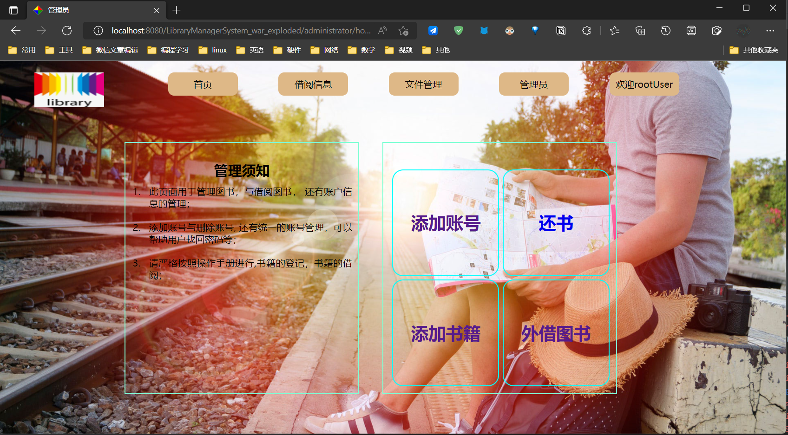
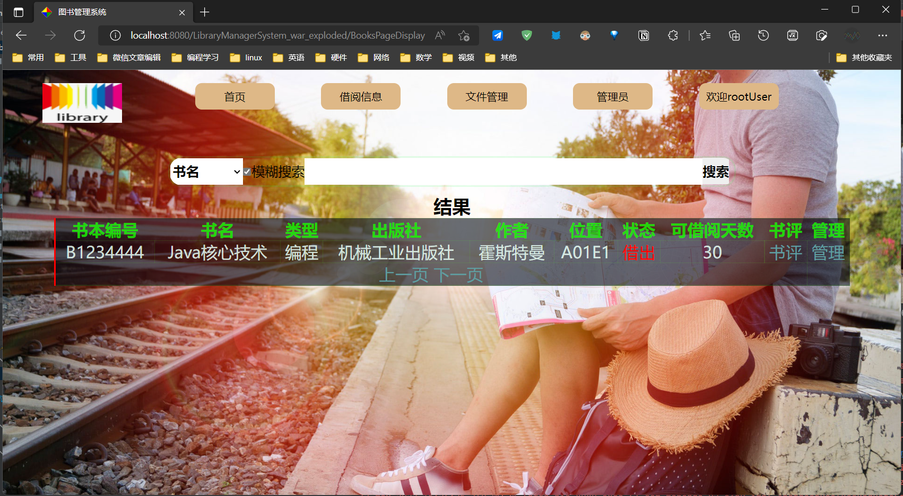
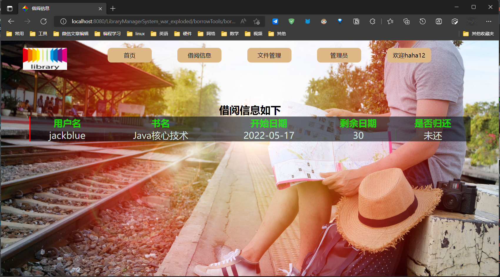
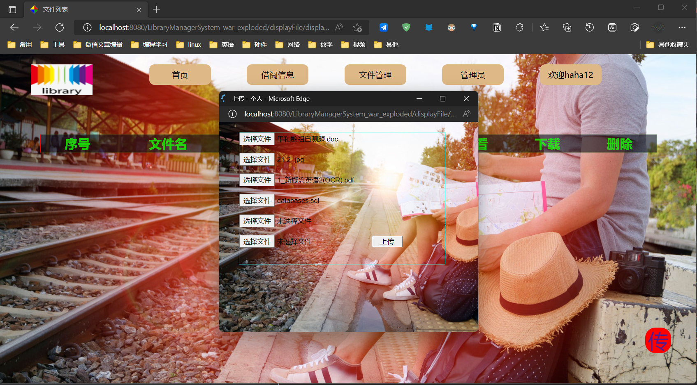
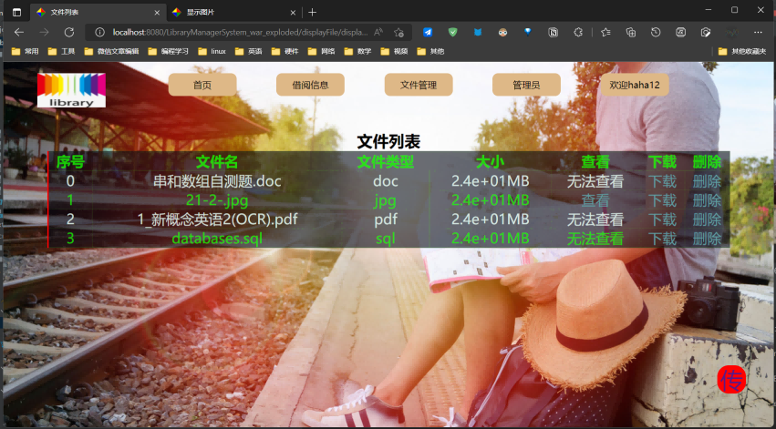
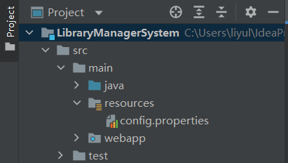
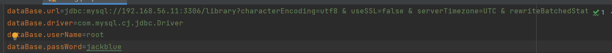

# 项目介绍
* 此项目基于JSP+Servlet技术，搭建的图书管理系统。
* 用户身份基于两种：管理员和不同用户。
* 功能模块分为图书查询、书评系统、私人网盘、图书关系几个模块。
* `管理员`可以管理图书、管理账户等功能，其他和不同用户别无二致。

# 模块
##管理员的图书管理模块

管理员账户通过此模块，可以对图书和账号进行管理。
## 书记查询系统

* 通过书记查询系统，可以查看图书馆是否有你想要的书籍。
* 通过多种查询方式，和模糊查询的方式，简单快熟的查找你要的书籍。
## 书籍评价系统

* 通过对查询到的图书，我们可以对它进行留言评价。
## 借阅信息查询

* 通过模块可以查询自己的借阅信息。
## 个人网盘模块

* 通过此模块可以上传文件

* 删除、下载、查看文件。
# 部署说明
## 关于构建
* 此项目使用Maven工具进行构建，推荐使用idea打开。
* 配置好tomcat环境即可运行。

## 对于数据库
* 部署之间请修改数据库文件，修改为本地数据库信息。

* 数据库sql文件在项目目录下，叫databases.sql
创建数据库后直接导入即可。

## 关于测试运行
* 默认管理员账户（账号：root 密码：123456）；
* 默认普通用户：（账号：jackblue 密码：123456）；